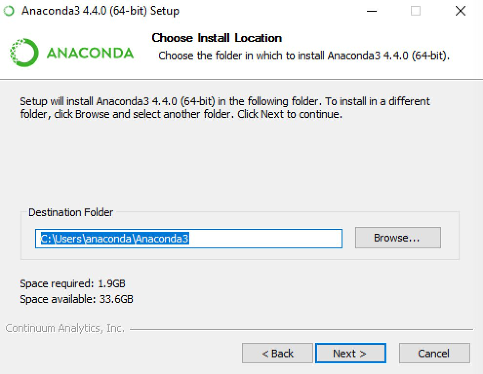

# 使用yolov5算法框架训练自己的数据

## 一、设备需求

设备带有独立显卡：GPU训练、部署

设备不带独立显卡：CPU训练、部署

独立显卡限定为NVIDIA显卡：GTX系列最为常见，MX系列显卡没有相关设备。

MAC用户只能自己动手搜索如何训练部署了。

本教程为win11环境下的yolov5框架的系统搭建和模型训练。（win10通用）

## 二、准备数据集以及训练代码

前往cvat网站下载自己的数据集。

下载导出的压缩包，并解压。

得到下面几个文件夹

| 文件夹     | 作用              |
| ---------- | ----------------- |
| ImageSets  | 划分数据集        |
| JPEGImages | 图片              |
| Annotation | 标注产生的xml文件 |

数据集导出完毕。

访问：[yolov5的github仓库]([ultralytics/yolov5: YOLOv5 🚀 in PyTorch > ONNX > CoreML > TFLite (github.com)](https://github.com/ultralytics/yolov5))

下载代码。

## 三、准备环境

​		环境的准备尤为重要，关系到代码能否顺利的运行。这里就需要大家应用到一种环境管理工具了。Python是一种面向对象的解释型计算机程序设计语言，其使用，具有跨平台的特点，可以在Linux、macOS以及Windows系统中搭建环境并使用，其编写的代码在不同平台上运行时，几乎不需要做较大的改动，使用者无不受益于它的便捷性。

​		此外，Python的强大之处在于它的应用领域范围之广，遍及人工智能、科学计算、Web开发、系统运维、大数据及云计算、金融、游戏开发等。实现其强大功能的前提，就是Python具有数量庞大且功能相对完善的标准库和第三方库。通过对库的引用，能够实现对不同领域业务的开发。然而，正是由于库的数量庞大，对于管理这些库以及对库作及时的维护成为既重要但复杂度又高的事情。

​		Anaconda就是可以便捷获取包且对包能够进行管理，同时对环境可以统一管理的发行版本。Anaconda包含了conda、Python在内的超过180个科学包及其依赖项。

​		Anaconda的安装需要注意很多事项，这里只做最基本的安装方式介绍。

原文：[Anaconda介绍、安装及使用教程 - 知乎 (zhihu.com)](https://zhuanlan.zhihu.com/p/32925500)

尊重原著作者。

### 安装Anaconda

1. 前往[清华大学开源镜像站]((https://mirrors.tuna.tsinghua.edu.cn/anaconda/archive/))下载。选择版本之后根据自己操作系统的情况点击下载。建议安装2022.5版本的。

2. 完成下载之后，双击下载文件，启动安装程序。

- 注意：

① 如果在安装过程中遇到任何问题，那么暂时地关闭杀毒软件，并在安装程序完成之后再打开。

② 如果在安装时选择了“为所有用户安装”，则卸载Anaconda然后重新安装，只为“我这个用户”安装。

3. 选择“Next”。

4. 阅读许可证协议条款，然后勾选“I Agree”并进行下一步。

5. 除非是以管理员身份为所有用户安装，否则仅勾选“Just Me”并点击“Next”。

6. 在“Choose Install Location”界面中选择安装Anaconda的目标路径，然后点击“Next”。

- 注意：

① 目标路径中**不能**含有**空格**，同时不能是**“unicode”**编码。

② 除非被要求以管理员权限安装，否则不要以管理员身份安装。

7. 在“Advanced Installation Options”中**不要**勾选“Add Anaconda to my PATH environment variable.”（“添加Anaconda至我的环境变量。”）。因为如果勾选，则将会影响其他程序的使用。如果使用Anaconda，则通过打开Anaconda Navigator或者在开始菜单中的“Anaconda Prompt”（类似macOS中的“终端”）中进行使用。

除非你打算使用多个版本的Anaconda或者多个版本的Python，否则便勾选“Register Anaconda as my default Python 3.x”。

然后点击“Install”开始安装。如果想要查看安装细节，则可以点击“Show Details”

8. 点击“Next”。

9. 进入“Thanks for installing Anaconda!”界面则意味着安装成功，点击“Finish”完成安装。

- 注意：如果你不想了解“Anaconda云”和“Anaconda支持”，则可以**不勾选**“Learn more about Anaconda Cloud”和“Learn more about Anaconda Support”。

  

10. 验证安装结果。可选以下任意方法：

① “开始 → Anaconda3（64-bit）→ Anaconda Navigator”，若可以成功启动Anaconda Navigator则说明安装成功。

② “开始 → Anaconda3（64-bit）→ 右键点击Anaconda Prompt → 以管理员身份运行”，在Anaconda Prompt中输入 ***conda list\*** ，可以查看已经安装的包名和版本号。若结果可以正常显示，则说明安装成功。

11.添加环境变量

- 找到anaconda安装位置，找到bin文件夹。

-    复制下面三个地址，是自己电脑中的安装位置。

  

- 打开高级系统设置（win11）：

  

- 打开cmd验证安装：win+r 输入cmd

输入conda，如果安装成功则会有如下显示。不成功则会提示conda不是内部命令。

### 创建环境

继续在cmd窗口创建conda环境：

输入：`conda init cmd.exe` 初始化conda。

输入

`conda create -n yolo python=3.10`

输入y，等待环境下好即可，如果连不上的话可以访问[这里]((https://mirrors.tuna.tsinghua.edu.cn/help/anaconda/))解决问题。

### 在pycharm中调用环境

打开pycharm，新建工程。随便使用何种编译器新建都可。

在设置中配置python编译器。

检查配置

将下载的yolov5源码复制到工程目录下：

打开终端

cd到yolov5目录下面。

`cd yolov5-master`

原文：[pypi | 镜像站使用帮助 | 清华大学开源软件镜像站 | Tsinghua Open Source Mirror](https://mirrors.tuna.tsinghua.edu.cn/help/pypi/)

更具指示更新pip并且换源，可以提升下载速度。

这里分为两类设备：

 **CPU部署环境：** 

输入：`pip install -r requirements.txt`

安装软件包。

 **GPU部署环境：** 

GPU部署需要安装cuda以及cudnn
统一安装cuda11。6版本，cudnn版本选择11.x版本的。

[参考链接](https://blog.csdn.net/Lisa20000920/article/details/123498857)

**必须安装这两个软件包才可以调用GPU训练模型。**

打开requirements.txt 文件

注释掉这两行

输入：

`pip3 install torch torchvision torchaudio --extra-index-url https://download.pytorch.org/whl/cu116`

安装好后再输入：

`pip install -r requirements.txt`

