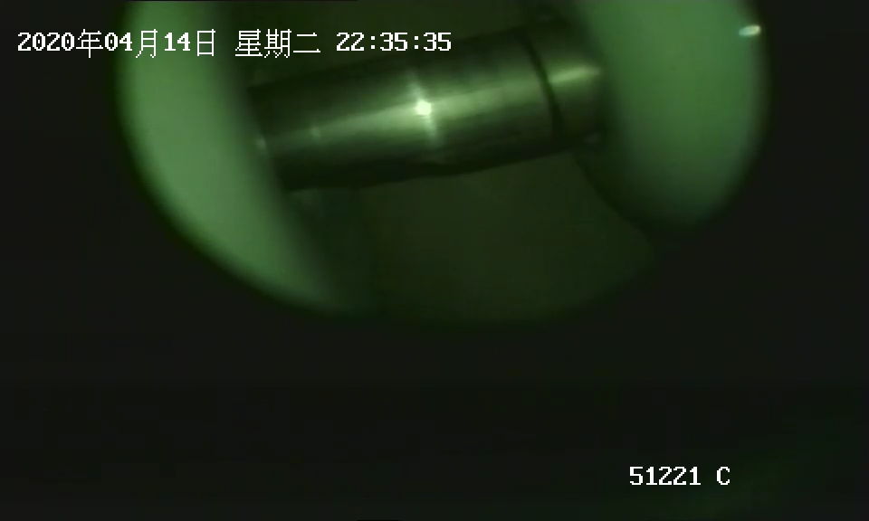
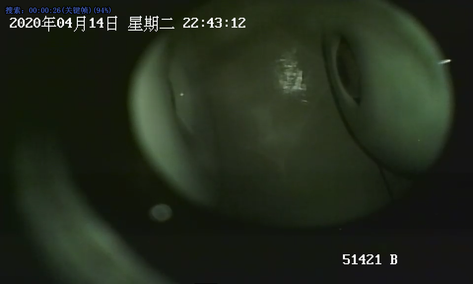
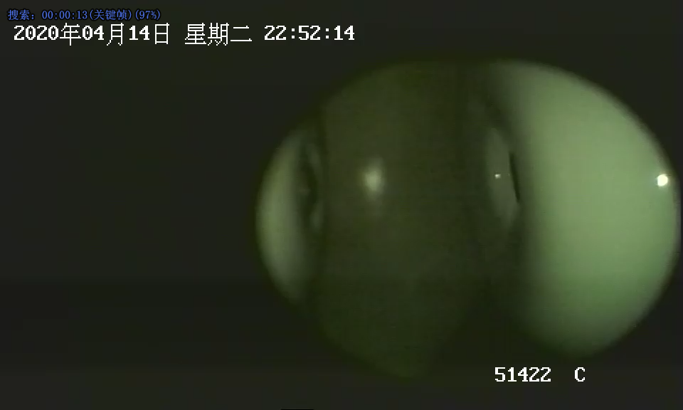
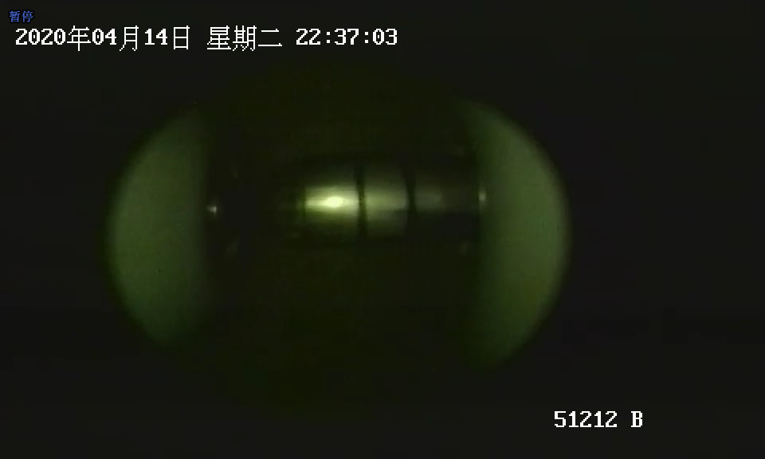
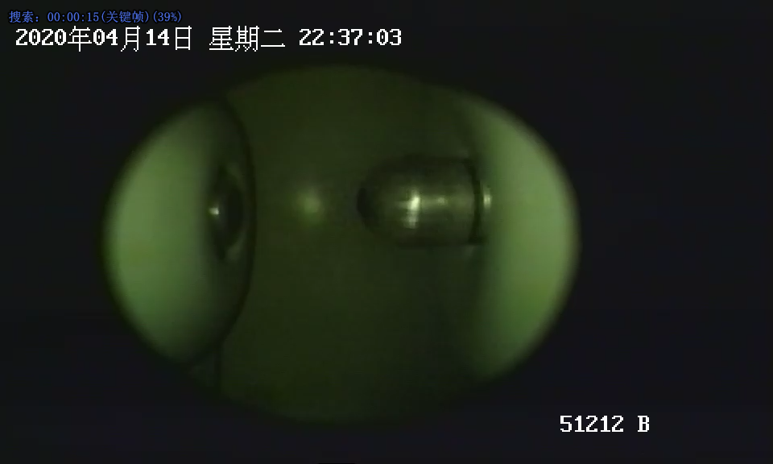
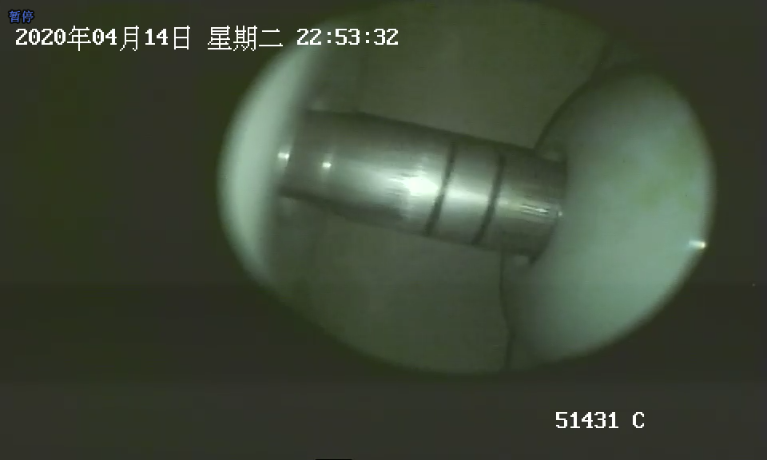
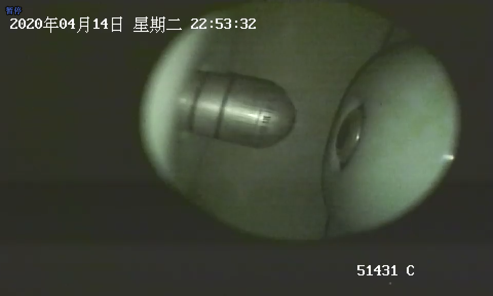

拣选标准
情况分为以下三种： **Closed，Running，Opened** 

分别对应如下情况：
 **关闭情况（Closed）：** 

 **开放情况（Opened）：** 

 **运行状态（Running）：** 

注：运行过程中会有闪亮画面，略去，拣选的照片中必须能够清晰可见当中刀闸的图像，也就是金属杆子。
若帧数不够则按照一下法则自行斟酌图片数量

每个视频的三种状态拣选出的图片必须数量相等即  **R=O=C** 
训练集、验证集、测试集比例为 **6：2：2** .即数量需为10的倍数，越多越好。

