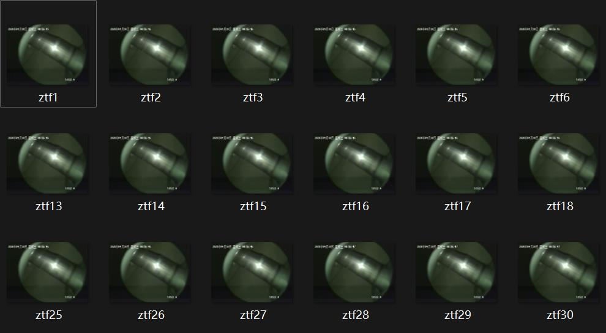
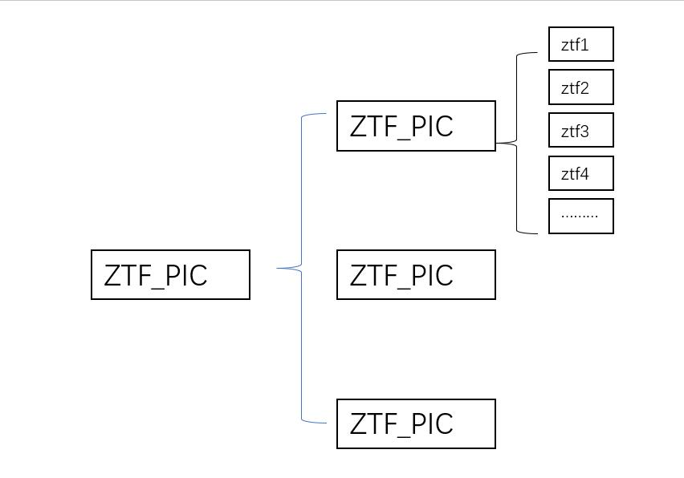

 **遍历更改文件名** 
```
# FilesBatchRename.py
# 导入os库
import os

# 图片存放的路径,不能有中文。
path = r"C:\Users\Lenovo\Desktop\closed"

# 遍历更改文件名
num = 1
for file in os.listdir(path):
    os.rename(os.path.join(path, file), os.path.join(path, "ztf"+str(num)) + ".jpg")# .join 的参数中”ztf“改为各位的首字母缩写
    num = num + 1
```
运行这个py代码，指定目录和自己的首字母缩写即可。
有首字母相同的同学注意：区分的方法是在首字母前加入大写的ABCDEFG，随意选择。


 **文件夹格式按照这个来存放，每个视频为一个文件夹，文件夹中只存放拣选好的图片。** 

